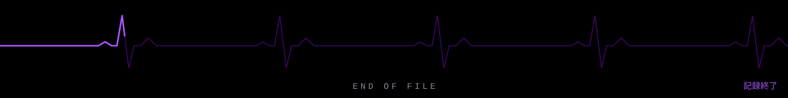

### About me &nbsp;わたしについて

I'm studying software development at Bellevue University, focused on web and desktop applications.

Most of what's here is coursework, practice projects, and things I take apart to understand better.

### Tools I use &nbsp;道具

  

### Away from the keyboard &nbsp;休みの日

*Lifting at the gym, wandering Azeroth in World of Warcraft, and shooting black and white photography.*

### Say hello &nbsp;便り

